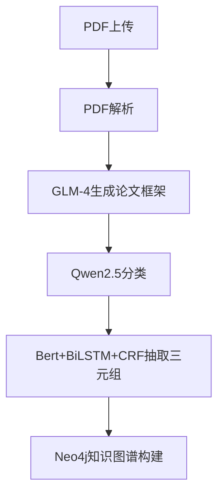
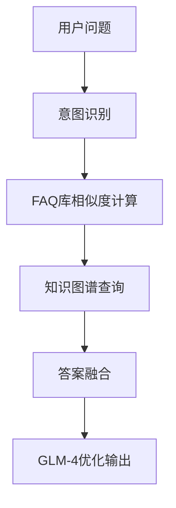

# An-Academic-Paper-Chatbot-based-on-Qwen2.5-and-Knowledge-Graph
基于知识图谱和大模型的对话系统

---

## 项目内容：

### 1. 项目描述: 
整合数十篇AI论文的知识点来搭建作为一个FAQ知识库,为研究生和教授们提供一个论文问答服务。

###  2. 项目主要构成: 
1. **对话系统 (Dialog System)** 【qwen2.5作为主模型，智谱API的 GLM-4 作为整合和优化最终回答的模型】
   1. 在对话流程的任何一个步骤上，用户如果说 “我没听清楚”，则必须让AI重新问一遍问题 【重听】。
2. **NER系统+知识图谱**：
   1. 使用 Bert+BiLSTM+CRF 抽取论文 [EntityTripleExtractor]（注意，这里不是论文框架）中的 <实体, 关系, 实体> 和 <实体，属性，属性值> 三元组 [构建结构化知识], 使用 neo4j 构建论文框架知识图谱
   2. 将论文框架的分类类别【12个类别之一】，作为论文实体的属性
3. **微调系统**：
   1. 使用 Qwen2.5 模型来针对 论文框架 集合进行微调 (SFT/LoRA), 实现论文自动分类，分到12个类别: ["Attention & Model Architecture", "Benchmarks", "BERT", "Chain-of-Thought", "Fine-Tuning", "Long-Context", "LoRA", "Instruction&Prompt-Tuning", "RAG", "RL", "RLHF", "Reasoning"]。  
4. **推荐系统**：
   1. 基于用户上传的论文，从知识库中推荐相关的论文
   2. 基于用户的问题，从知识库中推荐相关的论文  


5. **论文解析模块**：pdf上传+解析+分块存入FAQ库(向量数据库(Milvus))，每条数据是 {标准问，相似问，论文片段}的字典。FAQ库用于后期辅助 GLM-4 对最终答案进行优化（搜索相似问后加入上下文）
6.  [PaperFrameWorkExtractor]：使用 GLM-4 从论文中抽取论文框架 (paper framework, 包括摘要、引言、方法等, 实则为json格式的论文整体摘要)。
7.  [PaperFrameWorkClassifier]：使用 qwen2.5 进行论文框架分类 
8.  **系统输入**：
    1. 类型1：用户上传的论文.pdf+问题 【用于询问某片特定论文中的知识点】
    2.  类型2：仅用户的问题 【仅用于询问AI领域的某一个概念】


- FAQ库的单条数据格式:
  {"stand_query":"xxxx", "similar_query":set('xxx','xxx',...), "answer": xxxx}
- 论文框架结构[json格式的文本]：
  {"Abstract":'xxxxxx', "Introduction":"xxxxxxx", "Methodology":"xxxxxx", "Experiment":'xxxxxx', "Results": 'xxxxxxx'}


### 准备工作
  - 预先准备20篇大模型领域的论文，使用`Bert+BiLSTM+CRF` 抽取论文中的3元组，构建知识图谱。
  - 使用 `Qwen2.5` 模型对20个论文框架进行分类，预测论文类别。最后把预测出来的类别填充到知识图谱的论文实体中。

### 任务类型：
- 【任务1】：
  - 输入：用户上传的论文.pdf+问题
  - 流程：
    - 1. 解析上传的论文.pdf, 提取文本内容
    - 2. 使用 `GLM-4` 模型将论文文本转换为论文框架结构
    - 3. 使用 `Qwen2.5` 模型对论文框架进行分类，预测论文类别
    - 4. 使用 `Bert+BiLSTM+CRF` 模型从论文中抽取实体和关系，插入知识图谱
    - 5. 接入对话系统 (Dialog System)
      - 1. 文档片段召回。
      - 2. 先定位到与query最相似的段落，然后使用qwen2.5 执行两次二分类来锁定答案在该段落中的开头和结尾，最后得到 `raw_answer` (初始回答)
      - 3. 查询知识图谱中的相似实体：
        - 3.1 从 `raw_answer` 中提取实体
        - 3.2 根据实体，查询知识图谱，获取相关的实体、关系等信息
      - 4. 将知识图谱中的信息与 `raw_answer` 、召回的文档片段，进行融合，再送给 GLM-4 来生成整合后的最终答案。


- 【任务2】：
  - 输入：仅用户的问题
  - 流程：
    - 1. 先定位到与query最相似的知识图谱中的实体，然后使用 GLM-4 对搜到的实体进行答案整合。最后返回


### 项目输出：
使用Docker封装整个项目，并提供Rest API接口(fast api)对外提供服务


## 项目流程总结

- 论文处理流程



- 问答处理流程


- 所有组件概述
- PDF解析器: 负责从PDF文件中提取文本和章节结构
- 论文框架抽取器: 使用GLM-4提取论文的框架结构，包括摘要、引言、方法等
- 论文分类器: 使用Qwen2.5对论文进行分类，分到12个预定义类别
- 实体关系抽取器: 使用Bert+BiLSTM+CRF从论文中抽取三元组
- 知识图谱构建器: 将抽取的三元组存入Neo4j数据库，构建连接各实体的知识图谱
- 向量存储: 使用Milvus存储论文的文本片段，支持语义搜索
- 对话管理器: 管理用户查询处理流程，支持重听机制
- 推荐系统: 基于用户上传的论文或问题，推荐相关论文


## 项目结构


```
|--- Academic_Paper_Chatbot  
    |--- src  
        |--- configs/  
            |--- config.py            # 配置文件  
        |--- data/  
            |--- data_preprocess.py   # 数据预处理模块  
        |--- models/  
            |--- entity_extractor/    # 实体关系抽取模块  
                |--- bert_bilstm_crf.py  
            |--- paper_framework/     # 论文框架抽取模块  
                |--- extractor.py  
            |--- classifier/          # 论文分类模块  
                |--- qwen_classifier.py  
            |--- model.py             # 主模型接口  
        |--- dialogue_system/         # 对话系统  
            |--- dialog_manager.py  
            |--- response_generator.py  
        |--- knowledge_graph/         # 知识图谱  
            |--- kg_builder.py  
            |--- kg_query.py  
        |--- knowledge_base/          # 知识库  
            |--- vector_store.py      # 向量存储  
            |--- faq_manager.py       # FAQ管理  
        |--- recommendation/          # 推荐系统  
            |--- paper_recommender.py  
        |--- api/                     # API接口  
            |--- routes.py  
            |--- schemas.py  
        |--- utils/                   # 工具函数  
            |--- pdf_parser.py  
            |--- text_chunker.py  
    |--- main.py                      # 主入口  
    |--- Dockerfile                   # Docker配置  
    |--- requirements.txt             # 依赖包  

```


## 项目环境

- AutoDL Cloud Platform
  


- then, make sure to pre-download the model weight (e.g. Qwen2.5-1.5B on the huggingface) to the local storage (e.g., `/root/autodl-tmp/models/Qwen2.5-1.5B`).


## 使用方法

### 部署系统:
- 使用提供的Dockerfile构建镜像: docker build -t academic-chatbot .
- 启动容器: docker run -p 8000:8000 --gpus all academic-chatbot

### API使用:
- 上传论文: POST /upload_paper
- 提问问题: POST /ask
- 获取推荐: POST /recommend
- 获取论文列表: GET /papers


## 运行结果
- 存放在主目录的 `examples` 文件夹下。


# 用户指南

## 安装

### 方式一：通过pip安装【目前包还未上传，先别用】

```bash
# 安装
pip install paperchat

# 检查安装
paperchat --version
```

### 方式二：通过源码安装

```bash
# 克隆仓库
git clone https://github.com/paperchat/paperchat.git
cd paperchat

# 安装依赖
pip install -r requirements.txt

# 安装包
pip install -e .
```

### 方式三：使用Docker

```bash
# 使用Docker Compose启动全部服务
docker-compose up -d
```

## 初始化

首次使用前，需要初始化系统：

```bash
# 初始化数据库和向量存储
paperchat init --all

# 或单独初始化
paperchat init --db      # 只初始化数据库
paperchat init --vector  # 只初始化向量存储
```

## 导入论文

```bash
# 导入单个PDF文件
paperchat import /path/to/paper.pdf

# 导入目录中的所有PDF文件
paperchat import /path/to/papers/

# 递归导入目录及其子目录中的所有PDF文件
paperchat import /path/to/papers/ --recursive
```

## 启动服务

```bash
# 启动API服务器
paperchat server

# 指定主机和端口
paperchat server --host 0.0.0.0 --port 8000

# 启用系统监控
paperchat server --monitor

# 启动Web客户端
paperchat client

# 指定Web服务器端口
paperchat client --port 8080
```

## 知识图谱管理

```bash
# 构建知识图谱
paperchat kg build

# 查看知识图谱统计信息
paperchat kg stats

# 清空知识图谱(危险操作)
paperchat kg clear --force
```

## 使用Web界面

启动API服务器和Web客户端后，通过浏览器访问 http://localhost:8080 使用Web界面。

Web界面包含四个主要功能区：

1. **对话界面**：与论文进行对话查询
2. **论文库**：浏览和管理已导入的论文
3. **上传论文**：上传和分析新论文
4. **知识图谱**：可视化浏览知识图谱

### 基本使用流程

1. 导入论文
2. 在论文库中选择感兴趣的论文
3. 使用对话界面提问
4. 查看知识图谱了解概念关系

## 故障排除

常见问题：

1. **数据库连接失败**：检查Neo4j服务是否运行，配置是否正确
2. **向量存储异常**：检查Milvus服务是否运行，配置是否正确
3. **模型加载失败**：检查模型文件是否存在，路径是否正确

查看日志文件获取详细错误信息：

```bash
cat logs/paperchat.log
```

## 高级配置

配置文件位于 `src/configs/config.py`，可根据需要进行修改。

主要配置项：

- 模型路径和参数
- 数据库连接信息
- API服务器设置
- 日志配置

## 支持和反馈

如有问题或建议，请访问项目GitHub仓库创建Issue。


