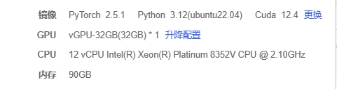

# An-Academic-Paper-Chatbot-based-on-Qwen2.5-and-Knowledge-Graph
基于知识图谱和大模型的对话系统


## 项目要求
_______
1. 所有模型配置，模型路径，超参数相关信息请放到一个单独的config.py文件里。
2. 所有数据集的加载和预处理工作请放到load.py文件里。
3. 模型的完整训练流程请放到main.py文件里。
4. 模型性能评估相关代码请放到evaluate.py文件里，包含一个Evaluator类。Evaluator类包含 eval, write_stats, show_stats, decode, write_stats_to_csv等成员函数。
5. 所有模型结构的设计，定义，请放到model.py文件中。
6. 所有数据集文件存放在项目目录的data目录下。
7. 所有模型权重存放在项目目录的model目录下。


## 项目内容：

项目环境：pytorch+gradio
### 1. 项目描述: 
整合数十篇AI论文的知识点来搭建作为一个FAQ知识库,为研究生和教授们提供一个论文问答服务。

###  2. 项目主要构成: 
1. 对话系统 (Dialog System) 【qwen2.5作为主模型，GPT-4o作为整合和优化最终回答的模型】
   1. 在对话流程的任何一个步骤上，用户如果说 “我没听清楚”，则必须让AI重新问一遍问题 【重听】。
2. 知识图谱 (Knowledge Graph) 【neo4j】
   1. 里面用来存储从论文中提取的实体三元组
3. 推荐系统：
   1. 基于用户上传的论文，从知识库中推荐相关的论文
   2. 基于用户的问题，从知识库中推荐相关的论文  
4. 论文上传, pdf解析+读取相关模块.
5. 使用 `GPT-4o` 从论文中抽取论文框架 (paper framework, 实则为md格式的论文整体摘要)。[PaperFrameWorkExtractor]
6. 使用 `qwen2.5` 进行论文框架分类 [PaperFrameWorkClassifier]
7. 使用 `qwen2.5` 来抽取论文中的实体三元组 [EntityTripleExtractor]


3. 系统输入：
   1. 类型1：用户上传的论文.pdf+问题 【用于询问某片特定论文中的知识点】
   2. 类型2：仅用户的问题 【仅用于询问AI领域的某一个概念】
4. FAQ库的单条数据格式:
   1. {"stand_query":"xxxx", "similar_query":set('xxx','xxx',...), "answer": xxxx}
5. 论文框架结构[md格式的文本]：
   1. {"Abstract":'xxxxxx', "Introduction":"xxxxxxx", "Methodology":"xxxxxx", "Experiment":'xxxxxx', "Results": 'xxxxxxx'}


### 项目任务:
- 使用 `Qwen2.5` 模型来针对 `论文框架` 集合进行微调 (SFT/LoRA), 实现论文自动分类，分到12个类别: ["Attention & Model Architecture", "Benchmarks", "BERT", "Chain-of-Thought", "Fine-Tuning", "Long-Context", "LoRA", "Instruction&Prompt-Tuning", "RAG", "RL", "RLHF", "Reasoning"]。

- 使用 `Bert+BiLSTM+CRF` 抽取论文（注意，这里不是框架）中的 `<实体, 关系, 实体>` 和 `<实体，属性，属性值>` 三元组 [构建结构化知识], 使用 `neo4j` 构建论文框架知识图谱
  - 将论文框架的分类【12个类别之一】，作为论文实体的属性 

- 准备工作
  - 预先准备20篇大模型领域的论文，使用`Bert+BiLSTM+CRF` 抽取论文中的3元组，构建知识图谱。
  - 使用 `Qwen2.5` 模型对20个论文框架进行分类，预测论文类别。最后把预测出来的类别填充到知识图谱的论文实体中。

- 两种任务：
- 【任务1】：
  - 输入：用户上传的论文.pdf+问题
  - 流程：
    - 1. 解析上传的论文.pdf, 提取文本内容
    - 2. 使用 `GPT-4o` 模型将论文文本转换为论文框架结构
    - 3. 使用 `Qwen2.5` 模型对论文框架进行分类，预测论文类别
    - 4. 使用 `Bert+BiLSTM+CRF` 模型从论文中抽取实体和关系，插入知识图谱
    - 5. 接入对话系统 (Dialog System)
      - 1. 文档片段召回。
      - 2. 先定位到与query最相似的段落，然后使用qwen2.5 执行两次二分类来锁定答案在该段落中的开头和结尾，最后得到 `raw_answer` (初始回答)
      - 3. 查询知识图谱中的相似实体：
        - 3.1 从 `raw_answer` 中提取实体
        - 3.2 根据实体，查询知识图谱，获取相关的实体、关系等信息
      - 4. 将知识图谱中的信息与 `raw_answer` 、召回的文档片段，进行融合，再送给 GPT-4o 来生成整合后的最终答案。


- 【任务2】：
  - 输入：仅用户的问题
  - 流程：
    - 1. 先定位到与query最相似的知识图谱中的实体，然后使用 gpt-4o 对搜到的实体进行答案整合。最后返回


- 【可选任务，非必须】
- 识别老师和学生**提交的问题的意图**
  - 在对话系统部署前，使用该系统的历史问答数据【问题-意图】对llama3进行微调，生成意图分类模型, 预测出当前用户的意图。
  - 将这个意图文本转为向量，和FAQ库中的问题来计算相似度。计算方法为：意图与standard_query计算相似度（score1），再与similar_query问题集中的所有问题计算相似度再取平均值(score2), 再计算当前论文的预测类别与FAQ中的样本的类别的相似度（score3）。
  - 最后将这3个分数以 5:5:10 的比例做加权和, 得到ranking_score, 计算当前意图与FAQ库中的每个样本的ranking_Score, 取分数最高的3条，将其中的Answer提取出来组合到一起：“Answer1: xxx. Answer2: xxxx. Answer3: xxxx”。

- 根据用意图查询FAQ库得到的回答，再用意图去查询知识图谱并返回比较匹配的{实体、关系、属性、类型、实例、量化信息、描述}（以字典形式返回）。再把FAQ的回答和知识图谱的返回信息组合成一个嵌套字典：meta_dict = {意图：{Answer1: xxx, Answer2:xxx, Answer3:xxx},  实体：xxx, 关系：xxx ...}。再把meta_dict作为输入给到GPT4o, 最后获取响应给到用户，同时将当前的响应，query内容、论文类别，加入到FAQ库中。


使用Docker封装查询结果并提供Rest API接口对外提供服务


## 项目流程总结
1. 用户通过前端界面上传论文PDF和提问的问题。
2. 服务器端解析PDF，提取文本内容。
3. 调用 `GPT-4o`，将论文文本转换为论文框架结构。
4. 使用 `Qwen2.5` 模型对论文框架进行分类，预测论文类别。
5. 使用Bert+BiLSTM+CRF模型从论文中抽取实体和关系，构建知识图谱。
6. 识别用户问题的意图，将其转换为向量。
7. 计算意图与FAQ库和论文类别的相似度，获取排名前3的答案。
8. 查询知识图谱，获取相关的实体、关系等信息。
9. 将FAQ答案和知识图谱信息组合成meta_dict，并作为输入提供给GPT-4，生成最终的回答。
10. 将回答、用户问题和论文类别添加到FAQ库中。
11. 使用Docker封装整个服务，提供REST API接口供外部调用。


## 项目结构

```Plain Text

|--- Academic_Paper_Chatbot
    |--- src
        |--- configs
            |--- config.py
            |--- data
    |--- agent
    |--- data
    |--- models
           |--- prm   
                  |--- prm.py
                  |--- orm.py
           |--- qwen2
                  |--- configuration_qwen2.py
                  |--- modeling_qwen2.py
                  |--- tokenization_qwen2.py
           |--- model.py
    |--- evaluation
            |--- evaluate.py

    |--- dialogue_system_test # 测试对话系统, 这里都是一些未整合进主项目中的技术

    |--- main.py   # 主训练文件， 不管Trainer在哪里定义，最后统统要在这里跑。


```


## 项目环境

- AutoDL Cloud Platform
  


- then, make sure to pre-download the model weight (e.g. Qwen2.5-1.5B on the huggingface) to the local storage (e.g., `/root/autodl-tmp/models/Qwen2.5-1.5B`).


## 运行结果
- 存放在主目录的 `examples` 文件夹下。